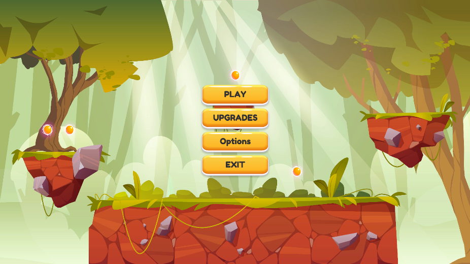
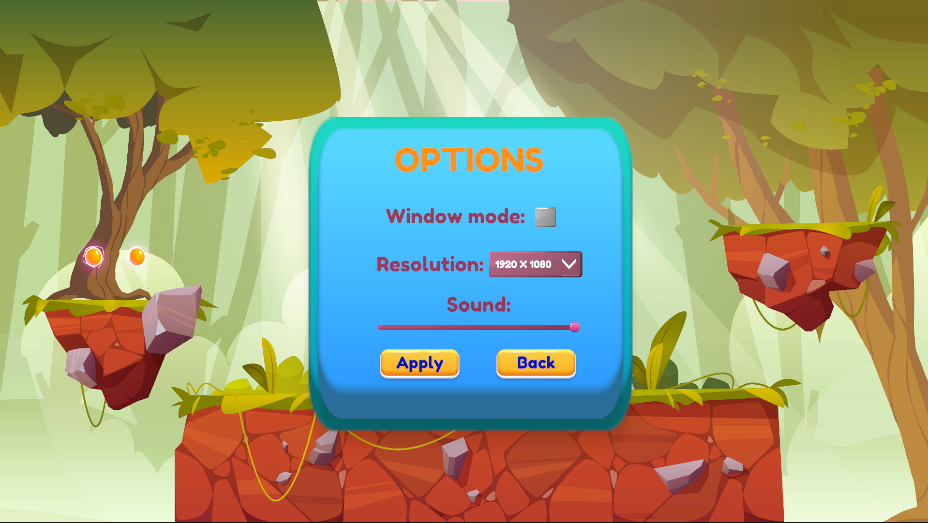
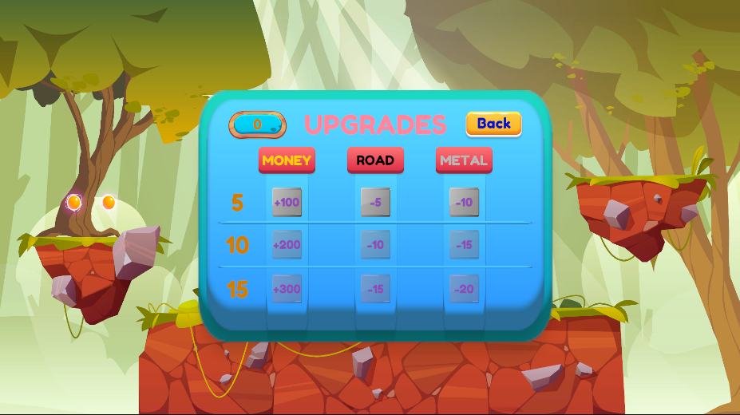
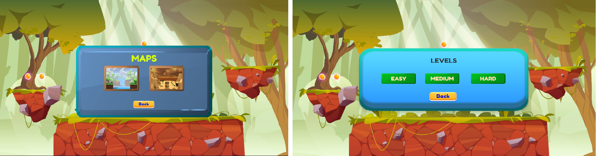
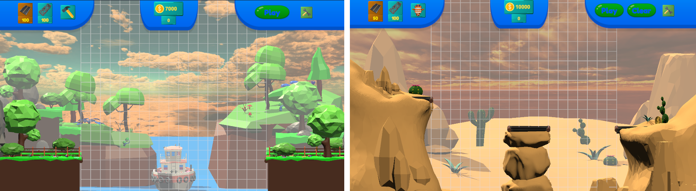
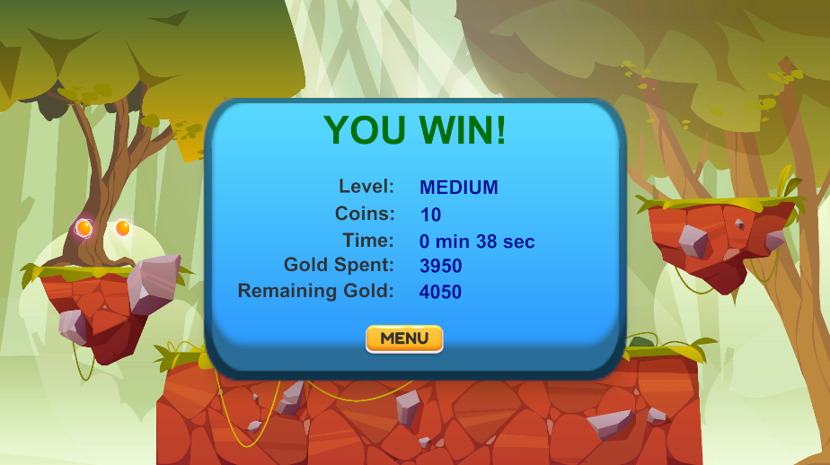

# Bridge Builder Game made in C#
<i> Unity Version: 2020.3.30f1 </i>

<h1> A prototype Bridge Builder game that allows you to build and simulate a bridge.</h1>

<h3> Launching the application shows main menu with four function buttons: „Play”, „Upgrades”, „Options” and „Exit”</h3>

 

<h3> the Exit button is used to close the application. </h3>
<h3> Options button allow you to go to the application settings panel. In this panel user, user can change screen resolution, change sound volume or open application in windowed mode.</h3>

 

<h3> The next button is „Upgrades” which opens special panel with upgrades that will help you complete the level of the map. There are upgrades such as: road facility cost reduction, metal facility cost reduction, and extra cash at start of the game. To buy any upgrades, user need special coins that can be obtained after completing a map level. </h3>

 

<h3> „Play” button opens the map panel. After selecting one of the two maps, another window with difficult level will appear. The higher leven, the better reward, but the higher level, the more difficult it is to complete the map. </h3>

 

<h3> Once the user selects a map and difficult level, game screen will appear. Game screen features an interface located at top of the screen that contains several special buttons. First button with road icon allows you to build road, second button with metal beam allows you build special objects to help strengthen the construction, next button with hammer icon allows you to remove object when you click on it. 

In the middle there is field containing current state of money and below it another field informing how much it will actually cost to build a given section. The next button is „Play” that allow you to start simulation of the constructed structure. „Clear” button allows you to clear the entire map and start building everything from scratch. The last button with „wrench” icon opens panel with which the user can return to main menu, open the options panel or exit the application. </h3>

 

<h3> The player’s goal is build stable structure taht will hold out weight of the vehicle that will have to drive over it. Afert starting simulation, user takes control of the vehicle and can personally check strength of the construction and reach the destination. When user reaches the destination, a summary window will be displayed: How much did it cost to build, how much money was left, construction time and how much special currency was earned. </h3>

 

<h3> This is a prototype game that is not finished yet. It still needs a lot of work to improve it and eliminate bugs that are there. </h3>

